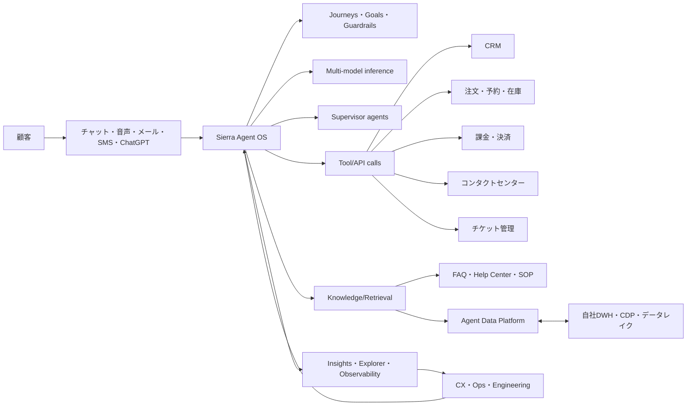

# Sierra.ai: ビジネス・システム・技術整理

作成日: 2026-05-03  
対象: https://sierra.ai/

このメモは、Sierra.ai について公開情報をもとに、ビジネスモデル、既存システムとの繋ぎ込み、実行基盤、データ確保、契約形態の観点で整理したものです。契約条件、詳細アーキテクチャ、個別顧客の実装は非公開部分が多いため、以下では「公開情報で確認できること」と「導入企業として確認・交渉すべきこと」を分けて記載します。

## 1. エグゼクティブサマリー

Sierra は、従来型のチャットボットやFAQ検索ではなく、企業の顧客接点を横断して動く「Customer Experience向けAI Agent OS」を提供する会社です。

主な特徴は以下です。

- 顧客対応AIエージェントを、チャット、音声、メール、SMS、WhatsApp、ChatGPT、コンタクトセンターなど複数チャネルに展開する。
- CRM、注文管理、課金、予約、在庫、保証、データウェアハウス、コンタクトセンターなど既存システムと接続し、単なる回答ではなく実処理まで行う。
- Agent Studio と Agent SDK により、CX/業務チームと開発者の両方がエージェントを構築・改善できる。
- 15以上の frontier/open-weight/proprietary model をタスクごとに使い分け、Supervisor、評価、回帰テスト、モデルフォールバックで本番運用を支える。
- Agent Data Platform により、会話履歴と構造化データを統合し、エージェントの「記憶」とパーソナライゼーションを作る。
- 価格は公開価格表ではなく、エンタープライズ契約。Sierra は outcome-based pricing、つまり解決済み会話、解約阻止、アップセルなど成果に基づく課金を掲げる。

一言で言うと、Sierra の競争力は「LLMのラッパー」ではなく、既存業務システムに接続された、監査可能で改善し続ける実行基盤を商品化している点にある。

## 2. 会社・市場ポジション

Sierra は Bret Taylor と Clay Bavor が創業したAIエージェント企業です。公開情報では、2025年9月に3.5億ドル調達、評価額100億ドルを発表しています。また、2025年11月にはARR 1億ドル到達を公表しています。

主な顧客として、Rocket Mortgage、SoFi、SiriusXM、Ramp、Brex、ADT、Sonos、Sutter Health、Next、CLEAR、Tubi、WeightWatchers などが挙げられています。金融、医療、通信、小売、旅行、メディアなど、規制・ブランドリスク・業務複雑性が高い領域に強く寄せています。

Sierra が狙っている市場は、単なるコールセンター効率化ではありません。公式発信を見る限り、中心テーマは以下です。

- 顧客対応コストの削減
- 解決率、CSAT、NPS、平均処理時間の改善
- 解約防止、アップセル、クロスセル
- 顧客との継続的な関係性、LTV向上
- 人間オペレーターの支援、Live Assist
- 企業ごとの顧客データと会話データを活用したパーソナライズ

## 3. ビジネスモデル

### 3.1 提供価値

Sierra の提供価値は、次の3層で見ると理解しやすい。

1. 自動応答
   - FAQ、ポリシー、注文状況、商品情報などへの回答。
   - 従来のチャットボットに近いが、Sierra はここだけを主戦場にしていない。

2. 業務実行
   - 返品処理、予約変更、保証申請、サブスク変更、本人確認、支払い、カード再発行など。
   - 既存システムのAPIを叩き、会話の中で実際の業務を完了させる。

3. 関係性・収益改善
   - 解約しそうな顧客への提案。
   - 顧客履歴に基づくプラン変更やアップセル。
   - 顧客ごとの文脈を持った継続対応。
   - 会話から新しいナレッジや改善点を抽出し、エージェントを継続改善する。

Sierra が「Agent Data Platform」や「Relationships」を強調しているのは、カスタマーサポートをコストセンターからLTV向上の接点へ変えたいからだと見られます。

### 3.2 顧客セグメント

公開顧客を見る限り、主対象は大規模B2C企業です。

- 毎月大量の問い合わせがある。
- ブランド体験の一貫性が重要。
- 顧客データ、注文、課金、予約、在庫など複数システムにまたがる。
- 規制や監査が必要。
- オペレーター席数課金ではなく、AIによる解決や成果に払うインセンティブがある。

小規模企業向けのセルフサーブSaaSというより、導入設計、統合、セキュリティレビュー、成果定義を伴うエンタープライズ販売です。

### 3.3 価格・課金

Sierra は公式に outcome-based pricing を打ち出しています。

公開情報で確認できる例は以下です。

- resolved support conversation
- saved cancellation
- upsell
- cross-sell
- ecommerce purchase
- membership saved

重要なのは「利用量」ではなく「価値ある成果」に課金するという思想です。Sierra は、会話が未解決の場合や人間へエスカレーションされた場合、多くのケースでは課金しないと説明しています。

ただし、すべてが純粋な成果課金とは限りません。Sierra 自身も、ルーティングやグリーター的なやり取りでは conversation count ベースのような consumption-based pricing を混ぜる場合があると説明しています。

したがって現実の契約は、おそらく以下のようなハイブリッドになりやすい。

- 最低年間契約額またはプラットフォーム利用料
- 初期導入・インテグレーション費用
- 成果単価
- 会話数またはチャネル利用量に応じた変動費
- サポート・SLA・セキュリティ要件に応じた追加費

公開価格表はありません。商談ごとの個別見積もりと考えるのが自然です。

## 4. 既存システムとの繋ぎ込み

### 4.1 繋ぎ込み対象

Sierra が接続対象として想定しているシステムは、公開情報から見ると以下です。

- CRM
- 注文管理システム
- 課金・請求システム
- 在庫システム
- 予約管理システム
- 保証・修理受付システム
- 会員管理
- ヘルプセンター、FAQ、ナレッジベース
- コンタクトセンター基盤
- チケット管理
- データウェアハウス、CDP
- 決済プロセッサ、決済ゲートウェイ

つまり、Sierra のエージェントは「会話UI」だけではなく、企業の systems of record に安全に接続される実行主体として設計されています。

### 4.2 導入時の典型フロー

実装イメージは以下です。

1. 業務対象を決める
   - 返品、配送状況、予約変更、解約防止、請求問い合わせなど。

2. 業務ルールを定義する
   - SOP、ポリシー、法務・コンプライアンス条件、ブランドトーン、禁止トピック。

3. ナレッジを接続する
   - FAQ、ヘルプセンター、社内文書、過去対応ログ、音声・通話履歴。

4. システム連携を作る
   - Agent Studio の Integration Library で標準連携を設定。
   - 複雑な処理は Agent SDK で独自ツール/APIを実装。

5. テストする
   - Simulations、回帰テスト、音声シミュレーション、red team。

6. ステージングから本番へ出す
   - Workspaces により変更管理、レビュー、ステージング、本番反映、ロールバック。

7. 運用しながら改善する
   - Insights/Explorer で会話を分析。
   - ナレッジ不足や不具合を発見。
   - Expert Answers やGhostwriterで改善案を作り、承認後に反映。

### 4.3 アーキテクチャ概念図

## 5. 実行基盤の技術

### 5.1 Agent OS

Agent OS は、Sierra の中核プラットフォームです。エージェントの構築、管理、改善、チャネル展開を統合するレイヤーと見られます。

主な構成要素は以下です。

- Agent Studio: ノーコード/ローコードでエージェントを構築・改善するUI。
- Agent SDK: 開発者がコードでJourney、ツール、ガードレールを定義する仕組み。
- Journeys: 業務フロー、目標、ポリシー、ツール利用を自然言語または構成要素として定義。
- Workspaces: GitHub風の変更管理、バージョン、QA、staging、production、rollback。
- Simulations: 大量のシナリオで事前検証。
- Insights: 会話分析、観測、監査、改善ループ。
- Live Assist: 人間オペレーター向けのリアルタイム支援。
- Voice: 電話対応用の音声エージェント。
- Agent Data Platform: 顧客文脈と会話履歴を統合する記憶レイヤー。

### 5.2 Multi-model architecture

Sierra は「どのLLMを使っているか」という問いに対して、単一モデルではなく constellation of models という考え方を説明しています。

ポイントは以下です。

- 15以上の frontier/open-weight/proprietary model をタスクごとに使い分ける。
- 分類、ツール呼び出し、応答生成、長文推論、検索、トーン、監督などで必要性能が違う。
- タスクごとに速度、精度、コスト、安定性、ブランド表現を最適化する。
- モデルの進化に応じて、内部のタスク単位で入れ替えられる。

この設計は、1つのLLMにすべてを詰め込むより本番運用に向いています。特に音声では低レイテンシが必要で、規制領域では高精度・高一貫性が必要になります。

### 5.3 モデルフォールバック

Sierra は Multi-Model Router を使い、各推論タスクごとにモデルの優先順位とフォールバック可否を制御すると説明しています。

重要なのは、単純に「落ちたら別モデルへ切り替える」ではない点です。モデルを変えると応答のトーン、判断、ツール選択が変わる可能性があります。そのため、以下を見ながら制御します。

- タスクごとのモデル優先順位
- provider のヘルス
- rate limit
- レイテンシ
- フォールバックしてよいタスクか
- ストリーミング応答中など、切り替えると違和感が出る状態か

provider 側のrate limitや障害に対しては、congestion-aware provider selector と admission controller のような仕組みを使うと説明されています。

### 5.4 Supervisor agents

Sierra は、本番エージェントを複数の supervisor agent で監督すると説明しています。

役割は以下です。

- 入力フィルタリング
  - prompt injection、jailbreak、context poisoning、不正・危険な要求を検知。

- 出力監査
  - ポリシー違反、危険表現、ブランド不一致、不適切なアクションを検出。

- 高リスク時の介入
  - 応答を修正、会話を終了、人間にエスカレーション。

- 会話後レビュー
  - 不具合、誤応答、改善候補をログ化。

Sierra の考え方は、LLMを完全制御するというより、非決定的な挙動を前提に「許容誤差を下げるシステム」を作ることです。

### 5.5 Retrieval/Search

Sierra は検索にも独自モデルを投入しています。公開情報では、Linnaeus と Darwin という2つの検索モデルが説明されています。

- Linnaeus: 会話全体を踏まえて検索する transcript-aware retrieval。
- Darwin: 顧客体験上、本当に解決に役立つ文書を選ぶ reranking。

通常のFAQ検索は「質問に似た文書」を探しますが、Sierra は「解決に必要な文書セット」を探す方向です。たとえば返品可否だけでなく、返金タイミング、例外条件、次の手順まで一緒に取得する。

この検索設計は、エージェントの解決率に直結します。

## 6. データ確保・データ戦略

### 6.1 Sierra が公開しているデータ方針

公開情報上、Sierra は以下を説明しています。

- 顧客データは顧客の指示通りにのみ使う。
- 他顧客と共有しない。
- 顧客データはモデル学習に使わない。
- PIIは自動で暗号化・マスキングされる。
- Trust Center でセキュリティ文書を提供。
- SOC 2、HIPAA、GDPR、PCI、CCPA、CSA STAR、ISO 27001、ISO 42001 などへの対応を掲げる。

Privacy Policy では、Sierra が顧客企業に代わって処理する Customer Data は、公開Privacy Policyではなく顧客との契約で処理されると説明されています。つまり、実務上はMSA/DPA/BAA/Security Addendumの確認が必須です。

### 6.2 Agent Data Platform の意味

Agent Data Platform は、会話履歴、チャット、メール、通話などの非構造データと、CRM、請求、在庫、取引、データウェアハウスなどの構造化データを統合するレイヤーです。

これにより、エージェントは以下を実現できます。

- 顧客名や過去会話を覚えた対応
- 過去の不満や好みを踏まえた提案
- 解約リスクの検知
- 顧客ごとのプラン・商品・オファー最適化
- 次に取るべきアクションの推薦
- プロアクティブな連絡やリテンション施策

これは強力ですが、導入企業にとってはロックインの源泉にもなります。会話データ、タグ、要約、記憶、推薦、改善ラベルがSierra側だけに蓄積されると、自社のデータ資産として再利用しにくくなるためです。

### 6.3 自社にデータを確保するための推奨アーキテクチャ

導入企業側は、Sierraを「唯一の顧客記憶」にしない設計が望ましい。

推奨は以下です。

- 全会話イベントを自社DWH/CDPへ同期する。
- tool call、API結果、解決判定、エスカレーション理由、CSAT、タグをイベントとして保存する。
- 音声の場合、音声ファイル、文字起こし、要約、話者分離、感情・意図ラベルの保持方針を決める。
- Agent Data Platform で生成された記憶や推薦理由を、自社側の customer profile にもwrite-backする。
- Expert Answers などで生成されたナレッジ記事を自社ナレッジベースにも保存する。
- エージェント改善用の評価データ、golden dataset、テストケース、回帰テスト結果のエクスポート可否を確認する。
- 契約終了時のデータエクスポート、削除、バックアップ削除、証明書発行を明記する。

### 6.4 契約で押さえるべきデータ項目

最低限、以下は契約またはDPAで確認する。

- Customer Data の定義
- Derived Data の定義
- 会話ログ、要約、タグ、embedding、memory、評価データの所有権
- Sierra が自社プロダクト改善に使える範囲
- モデル学習への利用禁止
- subprocessor 一覧
- LLM provider への送信データ範囲
- LLM provider 側の保持期間
- 保存リージョン
- 越境移転
- 削除・エクスポートSLA
- 人間レビューの有無とアクセス制御
- 監査ログ
- 個人情報・機微情報・PCI・HIPAA対象データの扱い

## 7. 契約形態

### 7.1 想定される契約構成

Sierra の顧客は大企業中心なので、契約は以下の組み合わせになりやすい。

- MSA
  - 基本契約、責任制限、保証、準拠法、支払い条件。

- Order Form / Pricing Schedule
  - 対象チャネル、利用範囲、料金、最低契約額、成果単価、超過条件。

- SOW
  - 初期導入、インテグレーション、テスト、移行、運用支援。

- DPA
  - 個人情報処理、controller/processor、subprocessor、SCC、削除、保持。

- BAA
  - 医療情報を扱う場合。

- Security Addendum
  - SOC 2、ISO、暗号化、アクセス制御、脆弱性管理、監査権。

- SLA
  - 稼働率、応答時間、障害通知、サポート。

- AUP
  - 禁止用途、濫用、違法行為、モデルスクレイピング禁止など。

### 7.2 outcome-based pricing の注意点

outcome-based pricing は魅力的ですが、契約設計が難しい。

確認すべき論点は以下です。

- 「解決」とは何か。
- 解決判定はSierra、顧客、自動判定、第三者のどれか。
- 後日再問い合わせが発生した場合、最初の会話は解決扱いか。
- 人間へエスカレーションした場合は非課金か。
- 途中までAIが処理して人間が完了した場合はどう課金するか。
- 返金、割引、特典付与による解決の場合、その費用は誰のKPIに入るか。
- AIが誤った処理をした場合の補償はどうなるか。
- 成果単価は業務種別ごとに変えるか。
- 最低利用料や上限額を設定するか。
- 成果測定に必要なデータをどちらが保持するか。

特に「Sierraが成果を作るほど顧客の請求額が増える」ため、予算上限と成果定義の透明性は必須です。

## 8. 導入企業から見たメリット

- 短期間で高度なAIエージェントを本番投入しやすい。
- 音声、チャット、メール、SMS、ChatGPTを単一エージェントで管理できる。
- 既存システムへの接続を前提にしているため、回答だけでなく処理完了まで行ける。
- Supervisor、回帰テスト、監査、観測性が整っている。
- outcome-based pricing により、理論上はベンダーと顧客のインセンティブが揃う。
- Agent Data Platform により、サポートをLTV改善やリテンション施策に広げられる。

## 9. 導入企業から見たリスク

- Sierra側のAgent OS、ADP、評価データに業務知識が蓄積し、ロックインが強くなる。
- outcome-based pricing の成果定義が曖昧だと、請求・ROI評価で揉める。
- LLM provider、subprocessor、リージョン、保持期間などの詳細確認が必要。
- 本番業務APIにAIが接続されるため、権限設計、承認フロー、監査ログが重要。
- 顧客対応の品質問題がブランド毀損に直結する。
- システム連携が深いほど、導入後の運用変更や既存システム改修の影響を受けやすい。
- Agent Data Platform に蓄積される派生データの所有権・移植性を明確にしないと、自社の顧客理解が外部SaaSに閉じる。

## 10. 導入検討時の質問リスト

### システム連携

- 標準コネクタで接続できるシステムは何か。
- 独自API連携はAgent SDKでどこまで実装できるか。
- tool call の認証、認可、監査ログはどう管理されるか。
- API失敗時、timeout時、部分成功時の挙動はどうなるか。
- 本番APIとstaging APIを分けられるか。
- 書き込み系アクションに承認ステップを入れられるか。

### 実行基盤

- モデル選択は顧客が制御できるか。
- モデルやproviderのsubprocessor一覧は開示されるか。
- フォールバック時に挙動差分をどう検証するか。
- Supervisorの判定ログは見られるか。
- 会話ごとのtrace、tool call、参照ナレッジ、推論理由はどこまで見られるか。
- 回帰テスト、シミュレーション、red team 結果をエクスポートできるか。

### データ

- Customer Data、Derived Data、Aggregated Data の定義は何か。
- 会話ログ、タグ、要約、embedding、memory、評価データは誰の所有か。
- 顧客データはLLM学習に使われないことが契約に明記されるか。
- 自社DWHへ全イベントを同期できるか。
- ADPの顧客記憶をエクスポートできるか。
- 契約終了時に全データをどの形式で返却できるか。
- 削除証明、バックアップ削除、保持期間はどうなるか。

### 契約・価格

- 何を成果として課金するか。
- 成果判定ロジックは監査可能か。
- エスカレーション時は課金されるか。
- 最低契約額と上限額はあるか。
- 初期導入費、プロフェッショナルサービス費は別か。
- SLA未達、誤処理、規制違反時の責任分界はどうなるか。
- 料金改定や成果単価の見直し条件は何か。

## 11. まとめ

Sierra は、顧客対応AIを「回答システム」から「業務を実行し、顧客関係を改善するプラットフォーム」へ拡張している会社です。

競争力は、単一LLMやチャットUIではなく、次の組み合わせにあります。

- 既存システム接続
- タスク別モデル運用
- Supervisorによる安全性
- シミュレーションと回帰テスト
- 観測性と改善ループ
- Agent Data Platformによる記憶とパーソナライズ
- outcome-based pricing による商用設計

導入企業としては、Sierraの運用基盤を活用しつつ、会話・行動・成果・評価データを自社DWH/CDPへ戻す設計が重要です。ここを押さえれば、Sierraは単なる外部AIツールではなく、顧客理解を深める実行基盤として使えます。逆に、ADPやInsightsに価値ある派生データが閉じると、長期的なデータ主権と移植性が弱くなります。

## 参考リンク

- [Sierra 公式サイト](https://sierra.ai/)
- [Sierra Product Overview](https://sierra.ai/uk/product)
- [Agent SDK](https://sierra.ai/uk/product/agent-sdk)
- [Agent Studio 2.0](https://sierra.ai/uk/blog/agent-studio-2-0)
- [Agent Data Platform](https://sierra.ai/uk/blog/agent-data-platform)
- [Outcome-based pricing for AI agents](https://sierra.ai/jp/blog/outcome-based-pricing-for-ai-agents)
- [Trust and reliability](https://sierra.ai/product/trust-and-reliability)
- [Privacy Policy](https://sierra.ai/privacy-policy)
- [Sierra hits $100M ARR milestone](https://sierra.ai/uk/blog/100m-arr)
- [Sierra $350M funding / $10B valuation](https://sierra.ai/uk/blog/theres-an-agent-for-that-and-it-runs-on-sierra)
- [Constellation of models](https://sierra.ai/jp/blog/constellation-of-models)
- [Model failover](https://sierra.ai/uk/blog/model-failover)
- [From LLMs to enterprise-grade agents](https://sierra.ai/blog/enterprise-grade-agents)
- [Linnaeus and Darwin search models](https://sierra.ai/blog/meet-linnaeus-and-darwin-the-sierra-search-team)
- [Evaluating and improving search](https://sierra.ai/blog/evaluating-and-improving-search)
