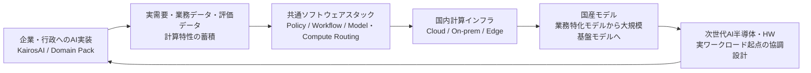
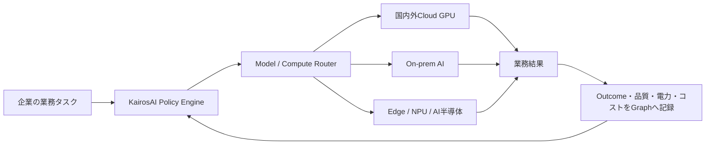
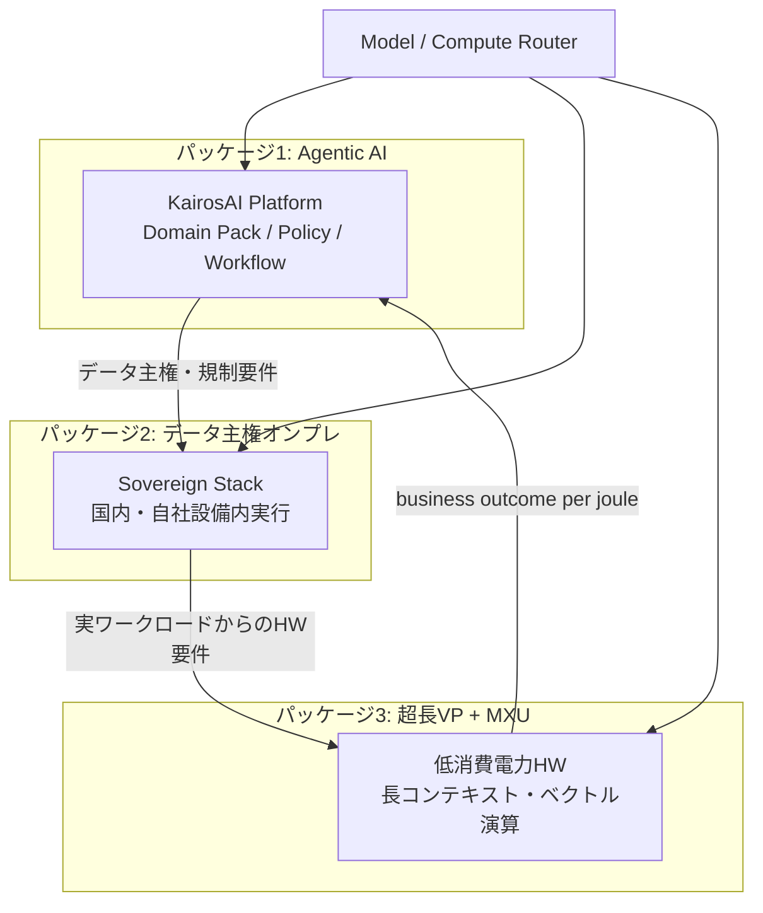
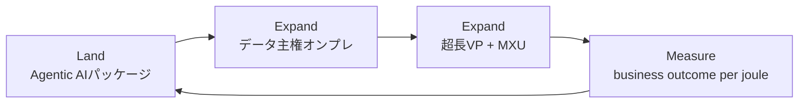

# KairosAIを起点とする需要起点型AI・HW産業戦略

作成日: 2026-06-09  
位置づけ: KairosAIの事業成長と、日本におけるAI・ソフトウェア・計算インフラ・ハードウェアの産業基盤形成を接続する構想メモ

## 1. エグゼクティブサマリー

AIとハードウェアは、一体のシステムとして設計する必要がある。

一方で、国産の汎用大規模言語モデルや計算インフラを先に整備しても、企業固有の業務、責任、監査、費用対効果に接続できなければ、継続的な利用と国内での価値獲得にはつながりにくい。

そのため、日本のAI産業基盤は、次の順番で構築することが重要である。

1. KairosAIのようなアプリケーションを企業・行政へ実装する
2. 実装を通じて、実需要、業務データ、評価データ、計算特性を蓄積する
3. 複数のモデル・クラウド・オンプレミス・エッジ機器を統合するソフトウェアスタックを構築する
4. 実需要を束ね、国内計算インフラを整備・最適化する
5. 蓄積した需要と評価基盤を用いて、業務特化モデルから国産大規模モデルへ発展させる
6. 実ワークロードから得た要件を、次世代AI半導体・ハードウェアの設計へ還流する

これは、国産モデルを先に作り利用先を後から探す「供給起点型」ではなく、企業・行政への実装から産業基盤を育てる **需要起点型AI産業戦略** である。

KairosAIは、この戦略において単なる業務アプリケーションではなく、企業の業務成果、AIモデル、計算資源、消費電力、コストを接続するコントロールプレーンを目指す。

クライアントへの提供物は、大きく次の三つのパッケージに整理する。

1. **Agentic AIパッケージ** — 業務知識グラフとPolicy / Workflowによる経営自動化基盤
2. **データ主権確保のためのオンプレシステムパッケージ** — 機密データを国内・自社設備内で処理するSovereign実行環境
3. **低消費電力な超長ベクトルプロセッサー + MXU** — 長コンテキスト推論とベクトル演算を省電力で担う専用ハードウェア

三つは独立販売も可能だが、需要起点型戦略では **Agentic AI実装 → データ主権要件の顕在化 → 実ワークロードに最適化したHW導入** の順で拡張する。ソフトウェアで実需要を獲得し、オンプレで規制対応を満たし、HWで電力・コスト効率を差別化する、段階的なクロスセル構造とする。

## 2. 基本認識

### 2.1 AIとHWは一体で考えるべきである

AIの性能と経済性は、モデル単体では決まらない。

モデル、学習・推論アルゴリズム、コンパイラ、ランタイム、メモリ、アクセラレータ、通信、データセンター、電力・冷却までを含むシステム全体で決まる。

今後の競争力は、モデルサイズやFLOPSだけではなく、限られた電力と計算資源から、どれだけの有用な成果を生み出せるかによって評価される。

そのため、技術評価の軸を以下へ広げる必要がある。

- モデル性能
- 業務成果
- 精度・信頼性
- 遅延
- 実行コスト
- 消費電力
- データ移動量
- セキュリティとデータ主権
- ハードウェア間の移植性

### 2.2 汎用LLM単体では企業実装につながりにくい

汎用LLMには大きな価値があるが、モデル単体では、企業における継続的な業務利用に必要な以下の要素を満たせない。

- 企業固有のデータと業務文脈
- 根拠と履歴
- 権限と承認
- 業務ルールと責任境界
- 外部システムとの接続
- 実行結果の監査
- 投資対効果の測定
- 機密性やデータ所在地への対応

したがって、国産モデルの開発そのものを最初の目的にするのではなく、企業・行政の業務へAIを実装し、利用される条件を先に明らかにする必要がある。

## 3. 戦略仮説

本構想の中核仮説は、以下である。

> 日本が目指すべきなのは、国産LLMを先に作り、利用先を後から探す政策ではない。企業・行政へのAI実装を起点として、実需要、評価データ、ソフトウェアスタック、計算インフラを段階的に構築し、その上で国産モデルと次世代AIハードウェアを育成する需要起点型AI産業戦略である。

この戦略は、一方向のロードマップではなく、実装結果を次の技術開発へ戻す循環構造として設計する。



## 4. KairosAIの役割

### 4.1 現在のプロダクト定義

KairosAIは、企業内の会話、文書、業務イベント、会計データをCanonical Eventとして記録し、根拠付きKnowledge GraphとPolicy / Workflowに変換することで、AIが候補を作り、ポリシーが安全に判断し、Workflowが実行するAutonomy Graph Platformである。

AIに最終責任を持たせず、人間はポリシー設計、例外対応、監査、モニタリングに集中する。

### 4.2 AI・HW戦略を統合したプロダクト定義

AI・HW協調を統合したKairosAIは、以下を担う。

> 企業の判断とAI実行を、監査可能かつ資源効率よく自動化するAutonomy Graph Platform

KairosAI自身が半導体を開発するのではない。企業の業務タスクを、要件に適したモデルと計算環境へ振り分け、その結果を業務成果まで含めて評価する制御基盤になる。



### 4.3 KairosAIが蓄積する戦略資産

企業実装を通じて、以下を蓄積する。

- 企業が実際に必要とするAIユースケース
- タスクごとに要求されるモデル能力
- 許容される精度、遅延、コスト、消費電力
- クラウド、オンプレミス、エッジの適切な配置
- モデル品質を測る業務評価データ
- 自動化できる業務と、人間判断が必要な業務の境界
- 将来必要となる計算資源の需要予測
- 次世代AI半導体に必要な処理・メモリ・通信特性

これらは、国産モデル、計算インフラ、AI半導体を実需要に合わせて開発するための基盤となる。

### 4.4 クライアント向け三つの提供パッケージ

KairosAIの事業は、クライアントに対して次の三つの提供パッケージとして定義する。いずれも単体提供が可能だが、実装を重ねるほど相互に価値が高まる設計とする。

#### パッケージ1: Agentic AIパッケージ

**定義:** 企業の判断とAI実行を、監査可能かつ段階的に自動化するソフトウェア基盤。KairosAIのAutonomy Graph PlatformとDomain Packを中核とする。

**含まれるもの:**

- Canonical Event、Knowledge Graph、Policy Engine、Workflow Engine
- Domain Pack（経理、意思決定支援、調達、製造、公共業務など）
- Evaluation Bus、Executive Monitoring、Model Gateway
- マネージドクラウドまたは顧客VPC上のSaaS型提供

**解く課題:** AIが「回答」で止まり、業務実行・承認・監査・改善ループにつながらない問題。企業固有の業務文脈と根拠を持ったAgentic実行を可能にする。

**主な顧客:** 一般企業、行政、AI利用を業務成果まで接続したい部門

**提供形態:** サブスクリプション（Core Platform + Domain Pack）+ 導入・統合支援

#### パッケージ2: データ主権確保のためのオンプレシステムパッケージ

**定義:** 機密データ、個人情報、業界規制対象データを、顧客のデータセンターまたは国内専用設備内で処理し、データ所在地・処理境界・監査要件を満たすSovereign実行環境。

**含まれるもの:**

- オンプレミスまたは専用Compute上のKairosAIスタック
- テナント物理分離、国内処理、データ保持ポリシー、詳細監査ログ
- 既存業務システム（会計、ERP、基幹）との閉域接続
- モデル推論のローカル実行、外部クラウドへのデータ非送出オプション
- Compute分離とPolicy Engineによる実行先制御

**解く課題:** クラウド汎用AIでは満たせない、データ主権・法規制・セキュリティ・可用性要件。金融、製造、公共、安全保障領域におけるAI実装の障壁。

**主な顧客:** 金融機関、製造・インフラ大手、自治体・省庁、規制産業

**提供形態:** ライセンス + オンプレ導入・運用支援 + Sovereign環境利用料（年間）

#### パッケージ3: 低消費電力な超長ベクトルプロセッサー + MXU

**定義:** 長コンテキストのベクトル検索、埋め込み推論、Graph連携RAGを、GPUクラスタに依存せず低消費電力で処理する専用ハードウェア。超長ベクトルプロセッサーが大規模ベクトル演算と長文脈処理を担い、MXU（Matrix Multiply Unit）が推論時の行列演算を効率化する。

**含まれるもの:**

- 超長ベクトルプロセッサー（長コンテキスト・高次元ベクトル演算に特化したアクセラレータ）
- MXU（推論ワークロード向け行列演算ユニット）
- KairosAI Model / Compute Routerとの統合ランタイム
- エッジ・オンプレ向けアプライアンスまたはボード製品
- 消費電力・遅延・スループットの実行テレメトリ連携

**解く課題:** クラウドGPU依存による高コスト・高電力・データ移動。企業内の大量文書・長期業務履歴・Knowledge Graph連携における、電力効率の悪い汎用計算。

**主な顧客:** データ主権パッケージ導入済み企業、エッジAI需要のある製造・インフラ、国内HWベンダーとの共同顧客

**提供形態:** HWアプライアンス販売・リース、ランタイムライセンス、保守・更新、共同開発による量産移行



**三パッケージの関係:** Agentic AIパッケージが実需要と評価データを生み、データ主権パッケージが規制対応と処理境界を確保し、超長ベクトルプロセッサー + MXUが電力・コスト効率で差別化する。KairosAIのModel / Compute Routerが三つを一つの制御面で統合する。

## 5. KairosAI既存設計との接続

KairosAIの既存設計には、AI・HW協調を実現するための主要な構成要素がすでに存在する。

| 既存構成要素 | AI・HW協調における役割 |
| --- | --- |
| Canonical Event | AI実行、モデル、HW、消費電力、コスト、結果を共通形式で記録する |
| Knowledge Graph | 業務タスク、意思決定、AI実行、計算資源、成果の関係を保存する |
| Policy Engine | 機密性、精度、遅延、コスト、電力制約から実行先を選択する |
| Workflow Engine | クラウド、オンプレミス、エッジで安全かつ監査可能に実行する |
| Evaluation Bus | 業務成果、モデル品質、消費資源を一体評価する |
| Domain Pack | 業界・業務・ハードウェアごとの実装単位になる |
| Compute分離 | 規制産業や機密業務向けの専用実行環境を提供する |
| Model Gateway | 特定モデルや計算基盤へのロックインを回避する |

Canonical Eventには、将来的に以下の実行テレメトリを追加する。

```yaml
execution_telemetry:
  model_id: string
  model_version: string
  provider: string
  hardware_type: string
  execution_location: cloud | on_prem | edge
  input_tokens: integer
  output_tokens: integer
  latency_ms: integer
  energy_wh: number
  estimated_carbon_g: number
  execution_cost: number
  quality_score: number
  outcome_id: string
```

## 6. 価値指標

データセンター事業者や計算基盤事業者は、設備効率、GPU利用率、消費電力などを測定できる。一方、通常は、その計算がどのような企業成果を生んだかまでは把握できない。

KairosAIはKnowledge GraphとWorkflowの実行履歴を使い、計算資源と業務成果を接続できる。

論文「AI+HW 2035」が提唱する `intelligence per joule` を、企業実装において以下の指標へ変換する。

> **business outcome per joule**

具体例:

- 請求書例外を1件解決するための電力量・コスト
- 月次決算を1日短縮するための総計算資源
- インフラ点検を1件完了するための電力量
- 調達承認を1件自動化するための電力量・コスト
- 意思決定資料を作成するための時間・電力・コスト
- 自動実行率を1ポイント向上させるための追加計算資源

この指標によって、安価なモデルを使うことだけではなく、業務全体を効率化できたかを評価する。

## 7. 段階的な事業展開

段階的展開は、三つの提供パッケージへのクロスセルとして設計する。最初はAgentic AIパッケージで実需要を獲得し、規制・機密要件が顕在化した顧客へデータ主権オンプレパッケージを拡張し、実ワークロードが蓄積された後に超長ベクトルプロセッサー + MXUを導入する。

| Phase | 主な提供パッケージ | 目的 |
| --- | --- | --- |
| Phase 1 | Agentic AI | 業務成果と責任境界の確立 |
| Phase 2 | Agentic AI + データ主権オンプレ | 実行基盤の最適化とSovereign対応 |
| Phase 3 | 三パッケージ統合 | 計算需要の集約とHW要件の顕在化 |
| Phase 4 | 三パッケージ + 国産モデル | 業務特化モデルの内製・共同開発 |
| Phase 5 | 三パッケージ + HW量産 | AI・HW協調開発と産業還流 |

### Phase 1: 企業・行政へのAI実装（Agentic AIパッケージ）

KairosAIのDomain Packを用いて、経理、意思決定支援、調達、製造、インフラ管理、自治体業務などへAIを実装する。

最初の目的は、AIモデルの開発ではなく、業務成果を生むユースケースと責任境界を確立することである。

主な収益源:

- Core Platform利用料
- Domain Pack利用料
- 導入・統合支援料

### Phase 2: AI実行基盤とデータ主権オンプレ（パッケージ1 + 2）

各タスクを、最適なモデルと計算環境へ振り分けるModel / Compute Routerを提供する。金融・製造・公共などでは、データ主権オンプレシステムパッケージを併売・後追い拡張する。

主な判断基準:

- 要求精度と信頼性
- データの機密性
- 許容遅延
- 実行コスト
- 消費電力
- 国内処理・データ所在地要件
- ハードウェアの空き状況

主な収益源:

- AI Control Plane利用料
- 推論量に応じた従量課金
- Sovereignオンプレ環境利用料・導入支援料

### Phase 3: 計算需要の集約（三パッケージの接続）

複数企業・行政機関の需要を束ね、国内クラウド、データセンター、オンプレミス、エッジ設備と接続する。

KairosAIは計算資源を大量保有する前に、どの計算資源が、いつ、どの業務で、どれだけ必要かを把握する立場を取る。この段階で、長コンテキスト・ベクトル演算の実需要が顕在化し、超長ベクトルプロセッサー + MXUの要件が具体化する。

主な事業機会:

- 国内計算基盤との需要集約契約
- 計算資源の予約・最適配置
- 低需要時間帯・地域電力状況に応じた実行制御
- HWベンダー、通信事業者、データセンターとの共同提供
- 超長VP + MXUのパイロット導入

### Phase 4: 国産モデル開発

企業実装から得た評価基盤と需要を使い、最初に業務特化モデル、小型モデル、エッジモデルを開発する。

その後、共通需要が十分に存在し、モデル開発の経済合理性が確認できた領域で、国産大規模モデルへ発展させる。

国産大規模モデルは、最初から目的化するのではなく、企業需要、評価データ、ソフトウェアスタック、計算基盤が蓄積した結果として開発する。

### Phase 5: AI・HW協調開発（超長VP + MXUの量産化）

蓄積された実ワークロードから、国内半導体・機器企業へ具体的なHW要件を提示し、超長ベクトルプロセッサー + MXUを量産・販売可能な第三の提供パッケージとして確立する。

- 必要な演算精度
- メモリ容量と帯域
- データ移動量とボトルネック
- エッジ推論性能
- 消費電力と熱設計
- セキュリティと隔離要件
- コンパイラ・ランタイム要件
- クラウド・エッジ間の連携要件
- 長コンテキストベクトル演算とMXUの協調設計

ハードウェア開発後は、再びKairosAIを通じて企業・行政へ実装し、成果を評価する。

## 8. ビジネスモデル

クライアントへの提供は、三つのパッケージを軸に設計する。各パッケージは独立契約が可能だが、実装の深まりに応じて上位パッケージへ拡張するランド・アンド・エクスパンド構造とする。

### 8.1 三パッケージ別の収益モデル

| 提供パッケージ | 収益源 | 提供価値 | 主な顧客 | 契約形態 |
| --- | --- | --- | --- | --- |
| **1. Agentic AI** | Core Platform利用料 | Event、Graph、Policy、Workflow、監査 | 一般企業・行政 | 月額/年額SaaS |
| | Domain Pack利用料 | 業務別スキーマ、Workflow、評価、Policy | 経理・調達・製造等 | パック追加課金 |
| | 導入・統合支援料 | 業務フロー設計、既存システム接続 | 大企業・行政 | プロジェクト型 |
| | 成果連動料金（将来） | 業務効率化・例外削減・自動実行率向上 | 成果測定可能な顧客 | 従量 + 成果報酬 |
| **2. データ主権オンプレ** | Sovereign環境利用料 | 国内・自社設備内の専用実行環境 | 金融、製造、公共、安全保障 | 年間ライセンス |
| | オンプレ導入・運用支援 | 閉域接続、監査設計、可用性運用 | 規制産業 | プロジェクト + 保守 |
| | 専用Compute・隔離環境 | テナント物理分離、データ保持ポリシー | 機密業務を持つ大企業 | 追加オプション |
| | Green Compute Control | モデル・実行先最適化、電力・コスト監視 | AI利用規模の大きい企業 | 利用量連動 |
| **3. 超長VP + MXU** | HWアプライアンス販売・リース | 低消費電力の長コンテキスト・ベクトル演算 | オンプレ導入済み企業、製造・インフラ | 機器 + 保守 |
| | ランタイム・ドライバライセンス | KairosAI Routerとの統合実行基盤 | HW導入顧客 | 年間ライセンス |
| | 共同開発・量産移行 | 国内半導体・機器企業との協業 | HWベンダー、NEDO実証 | 共同投資・ロイヤルティ |
| | 計算資源仲介（将来） | 国内計算基盤への需要集約 | クラウド・DC・通信事業者 | 仲介手数料・共同提供 |

### 8.2 クロスセルと導入順序



1. **Land（獲得）:** Agentic AIパッケージで業務実装を開始し、実需要と評価データを蓄積する。初期収益の中心はCore Platform、Domain Pack、導入支援。
2. **Expand（拡張）:** データ主権・規制要件が顕在化した顧客に、オンプレシステムパッケージを後追いまたは同時提案する。Sovereign環境利用料がARRを押し上げる。
3. **Expand（差別化）:** 長コンテキストRAG、Graph連携検索、エッジ推論の実ワークロードが蓄積された顧客に、超長ベクトルプロセッサー + MXUを提案する。電力・コスト削減を成果指標で可視化する。
4. **Measure（還流）:** 三パッケージ統合環境で得た実行テレメトリを、次のDomain Pack設計・モデル選定・HW要件へ還流する。

### 8.3 収益構成の時系列

| 時期 | 収益の中心 | 補助収益 |
| --- | --- | --- |
| 初期（Phase 1-2） | Agentic AI（Platform + Domain Pack + 導入） | Sovereignオンプレ（規制産業の先行顧客） |
| 成長（Phase 2-3） | Agentic AI + Sovereignオンプレ | Green Compute Control、従量課金 |
| 拡張（Phase 3-5） | 三パッケージ統合 | HW販売・ライセンス、計算資源仲介、成果連動料金 |

初期段階では、Agentic AIパッケージのCore Platform、Domain Pack、導入支援を中心とする。データ主権オンプレは規制産業の先行顧客から並行して獲得し、超長VP + MXUは実ワークロードと評価実績が蓄積してから本格展開する。計算資源の仲介や成果連動料金は、十分な利用量と評価実績を蓄積した後に導入する。

## 9. 政府・産業政策との接続

本構想は、既存政策を置き換えるものではない。以下の施策を、企業・行政の実需要と共通評価基盤によって接続する役割を持つ。

- 人工知能基本計画
- GENIAC
- NEDOの省エネAI半導体及びシステムに関する技術開発事業
- 国内AI計算資源・クラウド整備
- フィジカルAI・ロボティクス支援
- ワット・ビット連携
- データセンター省エネ政策
- 国産半導体・次世代計算基盤支援

政府向けの提言は、以下に集約できる。

> 日本のAI政策は、モデル、半導体、データセンターを個別に支援するだけでなく、企業・行政への実装を起点として、業務成果、評価データ、ソフトウェアスタック、計算インフラ、モデル、ハードウェアを循環させる必要がある。

### 政府との実証テーマ案

1. 複数の国産・海外モデルを同一業務で比較する共通評価基盤
2. 業務成果、精度、コスト、消費電力を統合した調達評価
3. 自治体・公共業務におけるクラウド・オンプレミス・エッジAIの最適配置
4. 国内AI半導体をKairosAIのDomain Packから利用する実証
5. 企業需要を集約し、国内計算基盤の整備・運用計画へ反映する仕組み

## 10. 実行ロードマップ

### 直近のKairosAI開発

既存MVPの`accounting`と`decision`への集中方針は維持する。初期MVPに大規模なHW対応を追加せず、将来の拡張に必要な計測点と抽象化だけを設計する。

| 時期 | 取り組み |
| --- | --- |
| MVP設計時 | Canonical Eventに実行テレメトリを任意項目として追加 |
| Pilot時 | クラウドモデルとローカル小型モデルの自動振り分けを実証 |
| Expansion時 | `compute_energy` Domain PackとModel / Compute Routerを追加 |
| 実績蓄積後 | 国内計算基盤・HWベンダーとの共同実証を開始 |
| 需要集約後 | 業務特化国産モデルを開発 |
| 長期 | 国産大規模モデルとAI・HW協調基盤へ発展 |

### 最初の90日

1. KairosAIのCanonical EventとEvaluation Busに、モデル・HW・電力・コスト計測項目を定義する
2. `accounting`または`decision`の1タスクで、複数モデル間の品質・コスト・遅延比較を実施する
3. ローカル小型モデルとクラウドモデルを切り替えるModel / Compute Routerの小規模実証を行う
4. `business outcome per joule`の測定方法を、代表ユースケース1件で定義する
5. AI企業、半導体企業、組込み・コンパイラ企業、計算基盤事業者、大学との発起人会を組成する
6. 政府・NEDO向けに、共同実証の2ページ提案書を作成する

## 11. KPI

### 事業KPI

- 有償導入企業・行政機関数
- Domain Pack別のARR
- 自動実行率と例外率
- 顧客業務時間・コストの削減額
- Model / Compute Router経由の実行量
- 国内計算基盤で実行された割合

### 技術KPI

- タスク成功率・品質スコア
- タスク当たり実行コスト
- タスク当たり消費電力
- タスク当たり遅延
- モデル・HW切替による性能低下率
- クラウド・オンプレミス・エッジ間の移植性

### 産業政策KPI

- 国内計算基盤へ集約した需要量
- 国産モデル・国産AI半導体の実業務利用件数
- 共通評価データセット数
- 企業実装からモデル・HW要件へ還流した件数
- 業務成果当たりの消費電力改善率

## 12. 主要リスクと対応

| リスク | 内容 | 対応 |
| --- | --- | --- |
| 戦略の広がりすぎ | アプリ、基盤、モデル、HWを同時に進めると焦点を失う | 商用MVPを優先し、各段階の進出条件を明確化する |
| 国産化の目的化 | 国内製であること自体が目的になり、品質・価格が伴わない | 業務成果、品質、コスト、電力で共通評価する |
| 計測精度 | モデル・HWごとの消費電力を公平に比較しにくい | 測定境界と推計方法を公開し、段階的に精度を高める |
| 特定HWへの依存 | ベンダーロックインにより利用可能性が下がる | Model Gateway、共通API、移植性評価を採用する |
| データ共有の制約 | 企業データをモデル・HW開発へ直接利用できない | 匿名化集計、評価結果、合成データ、顧客同意を活用する |
| 巨額投資 | 大規模モデル・計算基盤は資本負担が大きい | 需要を先に集約し、共同投資・政府支援へ接続する |
| 政策依存 | 政府支援が事業目的化する | KairosAI単体で成立する顧客価値と収益を維持する |

## 13. 対外メッセージ案

### 投資家・企業向け

> KairosAIは、Agentic AI、データ主権オンプレ、低消費電力HWの三つのパッケージで企業のAI実装を段階的に拡張する。業務自動化から始まり、規制対応と電力効率まで一貫して提供し、実需要を起点に日本で利用されるAI基盤を育てる。

### 三パッケージの短い表現

> ソフトで実装し、オンプレで守り、省電力HWで伸ばす。

### 政府向け

> 日本が構築すべきなのは、モデルや計算設備を個別に整備するだけのAI産業政策ではない。企業・行政へのAI実装を起点として、実需要、評価データ、統合ソフトウェア、計算インフラ、国産モデル、次世代ハードウェアを循環させる需要起点型AI産業基盤である。

### 短い表現

> アプリケーションから始め、国産AI・HW基盤へ遡る。

## 14. 参考資料

- [AI+HW 2035: Shaping the Next Decade](https://arxiv.org/html/2603.05225v1)
- [人工知能基本計画](https://www8.cao.go.jp/cstp/ai/ai_plan/ai_plan.html)
- [GENIAC](https://www.meti.go.jp/policy/mono_info_service/geniac/index.html)
- [NEDO 省エネAI半導体及びシステムに関する技術開発事業](https://www.nedo.go.jp/activities/ZZJP_100254.html)
- [ワット・ビット連携官民懇談会取りまとめ1.0](https://www.meti.go.jp/press/2025/06/20250612001/20250612001.html)
- [データセンターの省エネに関する新たな措置](https://www.enecho.meti.go.jp/about/special/johoteikyo/data_center2026.html)
- [KairosAI 事業・技術資料ドラフト](./kairosai-material-draft-2026-05-29.md)
- [KairosAI 検討結果 説明資料](./kairosai-explainer-2026-05-27.md)
