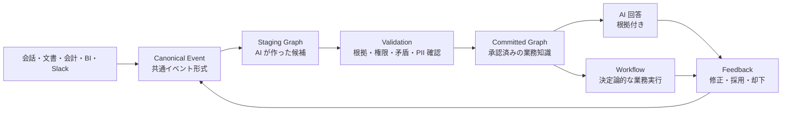
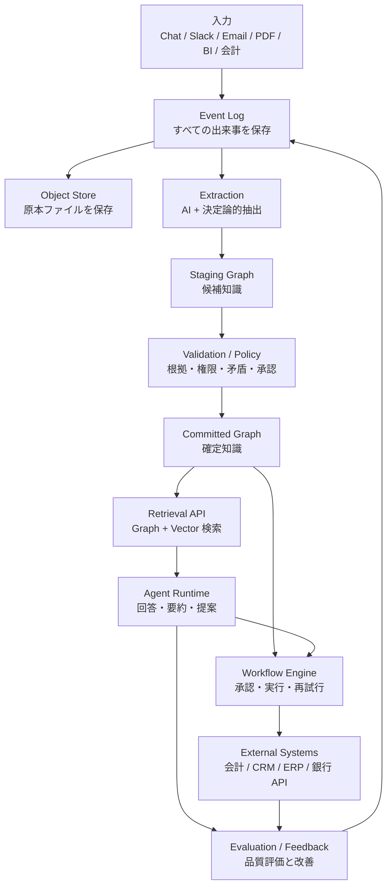
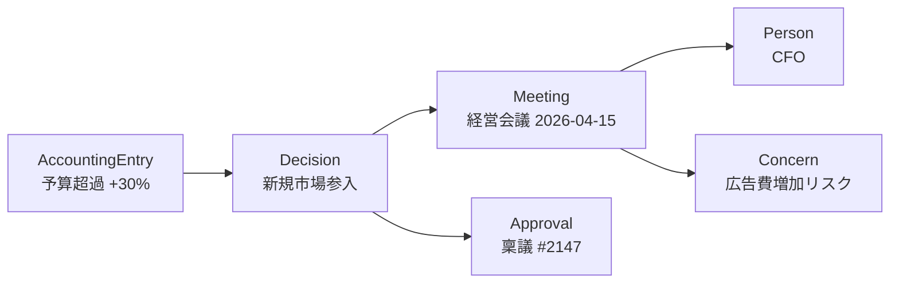
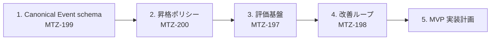

# KairosAI 検討結果 説明資料

作成日: 2026-05-27  
元資料: `kairosai-linear-progress-2026-05-27.md`

## 1. ひとことで言うと

KairosAI は、企業の会話・文書・業務イベント・会計データをつなぎ、AI が「根拠を持って回答し、安全に業務を進め、使われるほど賢くなる」ための業務 AI 基盤である。

単なるチャットボットではなく、企業ごとの業務知識グラフを育てながら、経理・決算オペレーションと経営意思決定支援の両方を扱う。

## 2. なぜ必要か

企業の重要情報は、Slack、メール、会議議事録、PDF、会計システム、BI、Excel、CRM などに散らばっている。

この状態では、AI に聞いても次の問題が残る。

- 根拠がどこにあるか分かりにくい
- 古い情報と新しい情報が混ざる
- 推測と事実が区別されない
- 経理や会計のような厳密処理を AI に任せるのは危ない
- AI の利用ログが次の改善に十分つながらない

KairosAI は、この問題に対して「イベントログ」と「知識グラフ」を中核に置く。

## 3. 何を作るのか

作るものは、企業内の情報を一度 `Canonical Event` として受け止め、そこから業務知識グラフを育てる基盤。

ポイントは、AI が直接「正しい事実」として保存しないこと。AI は候補を作り、根拠・権限・矛盾・個人情報・承認条件を通ったものだけを確定知識にする。

## 4. 2つの初期ユースケース

### ユースケース A: 経理・月次決算オペレーション

対象:

- 仕訳
- 消込
- 請求書・領収書
- 異常検知
- 月次レポート
- 監査対応

設計方針:

- 数値処理は AI に任せない
- 借方・貸方一致、残高、消込、会計ルールは決定論的に処理する
- AI は例外分類、説明、監査資料整理、レビュー補助に使う

### ユースケース B: 経営意思決定支援

対象:

- KPI / 予実
- 経営会議議事録
- 稟議・戦略文書
- 過去判断の参照
- 論点整理
- シナリオ分析

設計方針:

- 文書や会話から意思決定・論点・懸念・根拠を抽出する
- 回答には必ず citation と source span を付ける
- 「事実」「推論」「曖昧」を分けて扱う

## 5. 採用する基本方針

今回の検討では、`Hybrid（Graph 中核 + Workflow First）` を採用する。

これは、経理のような厳密な業務と、意思決定支援のような曖昧な業務を、同じ仕組みで無理に処理しないという考え方。

| 領域 | 主役 | 理由 |
| --- | --- | --- |
| 経理・会計 | Workflow Engine | 数値整合、承認、監査が必要 |
| 意思決定支援 | Retrieval + LLM | 文脈理解、論点整理、要約が必要 |
| 共通基盤 | Event Log + Knowledge Graph | 根拠、履歴、関係性、再処理を一元化する |

## 6. AI に任せること、任せないこと

KairosAI の重要な設計原則は、AI を「業務実行の最終責任者」にしないこと。

| AI に任せる | AI に任せない |
| --- | --- |
| 文書から論点を抽出する | 会計処理を確定する |
| 会議から意思決定候補を抽出する | 外部 API に直接 write する |
| 根拠付き回答を作る | 送金、契約、承認を勝手に実行する |
| 曖昧な情報をレビューに回す | 推測を事実として保存する |
| エラーや矛盾を説明する | tenant 境界や権限を自己判断する |

AI が出すのは「候補と根拠」。最終的な状態変更は、Workflow Engine、Policy Engine、人間承認で扱う。

## 7. システム全体像

## 8. データストアの考え方

初期構成は、運用を重くしすぎず、あとで拡張できる形にする。

| データ | 保存先 | 役割 |
| --- | --- | --- |
| すべての入力・出力・承認・実行ログ | Event Store | 再処理、監査、履歴確認 |
| PDF、音声、画像、原本文書 | Object Store | 原本保管、source span 参照 |
| 確定した知識関係 | Graph DB | 人・会社・案件・意思決定・会計情報の関係 |
| 文書 chunk や entity embedding | Vector Store | 意味検索、類似検索 |
| tenant、権限、workflow state | Relational DB | 決定論的な業務状態管理 |

推奨初期構成:

- Event Store: PostgreSQL append-only
- Relational DB: PostgreSQL
- Vector Store: pgvector
- Graph DB: Neo4j を第一候補
- Object Store: S3 / GCS / Azure Blob

## 9. なぜ Knowledge Graph が中核なのか

ベクトル検索だけだと、「似ている文書」は探せるが、業務上重要な関係までは扱いにくい。

Knowledge Graph にすると、次のような問いに答えやすくなる。

- この予算超過は、どの意思決定に由来しているか
- その意思決定は、どの会議で、誰が、どの懸念を出した上で決まったか
- この顧客の過去の懸念と、今回の問い合わせはつながっているか
- どの情報は明示された事実で、どれは AI の推論か
- どの根拠は古く、どれが最新か

例:

これにより、会計上の異常から、その背景にある意思決定までたどれる。

## 10. セキュリティとマルチテナント

企業向け AI では、顧客間のデータ混入が最も危険な失敗のひとつ。

KairosAI では、3段階で分離する。

| 分離レベル | 内容 | 対象 |
| --- | --- | --- |
| Logical | すべての table / node / edge に `tenant_id` を持たせる | 通常顧客 |
| Physical | 顧客専用 DB、専用 schema、専用 bucket | 金融、大企業、機密性が高い顧客 |
| Compute | 専用 worker、専用 LLM endpoint、専用 audit stream | SLA や規制要件が強い顧客 |

クロステナント学習では、個別の文書・会話・イベントを他社に流用しない。使えるのは匿名化された集計シグナルに限定する。

## 11. 今回決まったこと

今回の検討で固まったこと:

- 経理路と意思決定路は分けて設計する
- 共通基盤は Event Log + Knowledge Graph にする
- AI は候補生成と説明に使い、最終状態変更は Workflow Engine に任せる
- Staging Graph を挟み、AI の推測を直接確定知識にしない
- Graph DB は Neo4j を第一候補にする
- MVP では PostgreSQL + pgvector を活用し、運用を重くしすぎない
- tenant 分離は logical を基本にしつつ、金融・大企業向けには physical / compute 分離を用意する

## 12. まだ決めるべきこと

実装前に詰めるべき論点:

| 論点 | なぜ重要か |
| --- | --- |
| Canonical Event schema | すべての入力の共通形式。後工程の土台になる |
| Staging → Committed 昇格条件 | AI の候補をいつ事実として扱うかを決める |
| Graph schema | 人・会社・案件・会計・意思決定をどう表現するか |
| Evaluation 基盤 | 回答品質、引用妥当性、会計精度をどう測るか |
| Workflow Engine 選定 | Temporal で進めるか、MVP では軽量実装にするか |
| tenant 分離の価格・プラン設計 | physical / compute 分離をどの顧客に提供するか |

## 13. 次に進める順番

優先順位:

1. `MTZ-199` Canonical Event schema  
   入力形式が決まると、Event Store、Object Store、再処理、provenance chain が設計できる。

2. `MTZ-200` Staging → Committed 昇格ポリシー  
   AI が作った候補を、どの条件で安全に確定知識へ移すかを決める。

3. `MTZ-197` モデル評価基盤  
   経理路と意思決定路で評価指標が違うため、早めに分けて設計する。

4. `MTZ-198` トレーニング／改善ループ  
   初期は RLHF ではなく、retrieval、reranking、confidence calibration、preference learning に集中する。

## 14. 説明用トークトラック

30秒で説明するなら:

> KairosAI は、企業の文書、会話、会計データ、業務イベントを全部イベントとして受け止め、そこから企業ごとの Knowledge Graph を育てる基盤です。AI はそのグラフを見て根拠付きで答えます。ただし、会計処理や外部システム更新のような危険な実行は AI が直接やらず、Workflow Engine と承認プロセスで安全に進めます。

3分で説明するなら:

> 既存の AI 導入は、チャットや検索に閉じがちで、企業固有の判断や業務履歴が資産として育ちにくいです。KairosAI では、会話・文書・会計・BI・Slack などをまず Canonical Event に変換し、AI が候補ノードや関係を抽出します。ただし、そのまま本番データにはせず、Staging Graph で根拠、権限、矛盾、個人情報、承認要否を確認します。確定したものだけ Committed Graph に入り、AI の回答や Workflow の業務実行に使われます。経理のような厳密な処理は決定論的に、意思決定支援のような文脈理解は Retrieval + LLM で扱う Hybrid 構成です。

## 15. 結論

KairosAI の中核は、AI エージェントそのものではなく、企業ごとに育つ安全な業務知識基盤である。

次に `Canonical Event schema` と `Staging → Committed 昇格ポリシー` を固めれば、PoC / MVP 実装に進める。
