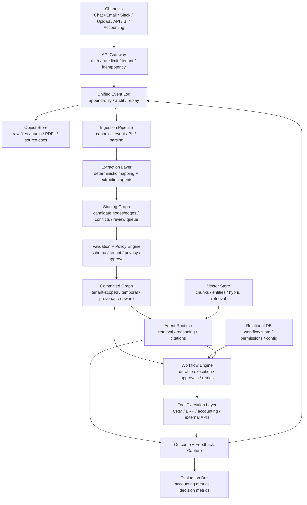

# KairosAI Linear 作業結果

作成日: 2026-05-27  
対象: [KairosAI Linear Project](https://linear.app/mtzd/project/kairosai-6d2b87dc5fc9)

## 1. 今回やったこと

Linear の KairosAI project を確認し、現在 In Progress かつ High priority だった `MTZ-196` を次に進める対象として扱った。

`MTZ-196` は「Knowledge Graph 中核設計」の Section 3、つまりシステム構成（ストア／層／責務分担）を詳細化する Issue。関連する Linear Document `Knowledge Graph 中核設計 — Brainstorm Draft` と、ローカル設計メモを照合した。

確認した主な参照元:

- Linear Document: `Knowledge Graph 中核設計 — Brainstorm Draft`
- `/Users/so01/codex/Agentic AI PJ/agentic-knowledge-graph-idea.md`
- `/Users/so01/codex/Agentic AI PJ/technical-architecture-elements.md`
- `/Users/so01/codex/Agentic AI PJ/core-product-business-model.md`
- `/Users/so01/codex/Agentic AI PJ/financial-institution-tokenized-operations.md`
- `/Users/so01/codex/Agentic AI PJ/sierra_ai_business_system_technical_overview.md`

## 2. Linear 現状

Project:

- Name: `KairosAI`
- Summary: `AgenticAIを実装するための会社`
- Team: `Mtzd`
- Project status: `Backlog`
- Project resources: `Knowledge Graph 中核設計 — Brainstorm Draft`

関連 Issue:

| Issue | Priority | Status | 内容 | 今回の判断 |
| --- | --- | --- | --- | --- |
| `MTZ-196` | High | In Progress | Section 3: システム構成 | 今回の主対象。Section 3 成果を整理済み |
| `MTZ-197` | Medium | Backlog | Section 4: モデル評価基盤 | 次点。評価基盤を spec 化する |
| `MTZ-198` | Medium | Backlog | Section 5: トレーニング／改善ループ | 評価基盤の後に進める |
| `MTZ-199` | Medium | Backlog | Canonical Event schema | 実装前に詳細 schema と migration 方針が必要 |
| `MTZ-200` | Medium | Backlog | Staging → Committed 昇格ポリシー | Policy Engine 実装の前提にする |
| `MTZ-195` | No priority | Backlog | システム全体像を整理していく | 上位 umbrella issue として扱うのがよさそう |

## 3. MTZ-196 の成果

`MTZ-196` の完了条件は以下だった。

- 全コンポーネントの責務と依存関係が図示されている
- 各データストアの選定理由（候補技術、トレードオフ）が記載されている
- AI 層と決定論的層の境界がルールとして明示されている
- マルチテナント分離の具体方針が決まっている
- Brainstorm Draft document の Section 3 として追記済み

確認結果として、Brainstorm Draft の Section 3 は上記をおおむね満たしている。以下に、実装計画へ進めやすい形で再整理する。

## 4. 採用アーキテクチャ

採用アプローチは `C. Hybrid（Graph 中核 + Workflow First）`。

設計思想:

- 経理・決算系は、構造化データ中心かつ決定論的 Workflow 主導で扱う
- 意思決定支援は、文書・会話・議事録中心かつ Retrieval + LLM 主導で扱う
- 両者を共通の Event Log と Graph schema に集約する
- AI は候補生成・抽出・要約に閉じ、状態変更や金銭・会計処理は Workflow Engine が担当する
- すべてのノード・エッジに provenance、source span、confidence、tenant_id を持たせる



## 5. データストア方針

| Store | 責務 | 初期候補 | 判断 |
| --- | --- | --- | --- |
| Event Store | canonical event、tool call、approval、outcome を追記専用で保存 | PostgreSQL append-only | 初期は Postgres で十分。Kafka はイベント量が増えてから |
| Object Store | PDF、音声、画像、原本文書、エクスポートを保存 | S3 / GCS / Azure Blob | Graph には原本を埋めず URI と source span のみ保存 |
| Graph DB | Committed Graph の node / edge / temporal relation を保存 | Neo4j / Memgraph / Apache AGE | path query と可視化重視なら Neo4j を第一候補 |
| Staging Graph | 抽出候補、曖昧 edge、矛盾、レビュー待ちを保存 | Graph DB 別 namespace / Relational | Committed と物理または namespace 分離する |
| Vector Store | chunk / entity embedding、semantic retrieval | pgvector / Qdrant / Weaviate | 初期は pgvector。検索品質・規模が上がれば Qdrant |
| Relational DB | tenant、role、permission、workflow state、approval、billing、settings | PostgreSQL | 決定論的状態管理の中心 |

初期構成としては、PostgreSQL を Event / Relational / Vector の中心に置き、Graph DB だけ Neo4j に切り出すのが現実的。運用を軽くしたい MVP では Apache AGE で Postgres に寄せる案もあるが、複雑な traversal、path query、graph visualization を重視するなら Neo4j が強い。

## 6. 層構成と責務

| Layer | 責務 | 主要コンポーネント |
| --- | --- | --- |
| Channels | ユーザー・外部システム接点 | Web, Chat, Slack, Email, Upload, API |
| Gateway / Identity | 認証、認可、tenant 強制、rate limit、idempotency | API Gateway, IAM, Policy pre-check |
| Event / Ingestion | 入力を canonical event 化し、原本と source span を保存 | Event Log, Object Store, Parser, OCR |
| Extraction | 構造化 mapping と非構造 extraction | deterministic mapper, LLM extraction agents |
| Validation | schema、privacy、tenant、confidence、approval 判定 | Validation Layer, Policy Engine |
| Storage | staging / committed / vector / relational を管理 | Graph DB, pgvector, PostgreSQL |
| Retrieval / Query | permission-aware な graph + vector + temporal retrieval | Query API, Evidence Ranker |
| Execution | 業務実行、承認、retry、compensation、tool call | Workflow Engine, Tool Execution Layer |
| Observability / Evaluation | trace、audit、quality metric、regression | Audit Log, Evaluation Bus, Dashboard |

## 7. AI と決定論的処理の境界

基本ルールは、AI が出すのは「候補と根拠」、決定論的システムが担うのは「事実判定と状態変更」。

| 判断基準 | AI に任せる | 決定論的に処理する |
| --- | --- | --- |
| 文脈理解、論点抽出、候補生成 | Yes | No |
| source span 付きの entity / relation extraction | Yes | Validation 後に commit |
| 仕訳、消込、残高、借貸一致などの数値整合 | No | Yes |
| 外部 API write、会計更新、送金、契約処理 | No | Yes |
| 承認要否の判定 | 補助説明のみ | Policy Engine |
| confidence score の生成 | Yes | 閾値判定は deterministic |
| 監査対象の最終判断 | 補助のみ | Human / Workflow / Policy |

禁止ルール:

- AI が直接 Committed Graph に書き込まない
- AI が外部 API write を直接実行しない
- `INFERRED` や `AMBIGUOUS` を事実として扱わない
- source span がない情報を自動昇格しない
- tenant boundary を prompt や agent logic だけに任せない

## 8. マルチテナント分離方針

| 分離レベル | 仕組み | 適用先 |
| --- | --- | --- |
| Logical | 全 table / node / edge に `tenant_id`。Row-Level Security と Query Layer で強制 | 通常 tenant |
| Physical | tenant 専用 DB / schema / vector index / object bucket | 金融、大企業、医療、経営機密が濃い tenant |
| Compute | 専用 worker pool、専用 model endpoint、専用 audit stream | SLA や規制要件が強い tenant |

クロステナント学習:

- 許可: 匿名化された aggregate signal、公開情報、モデル評価の統計値
- 禁止: tenant A の raw event / document / golden data / preference を tenant B に流用すること
- 実装: evaluator / trainer の data access layer で `tenant_id` を必須フィルターにし、横断アクセスは別 audit log を必須にする

## 9. 経理路と意思決定路の分岐

経理路:

```text
Canonical Event
  -> deterministic schema mapping
  -> numerical validation
  -> Staging Graph
  -> Validation / Approval
  -> Committed Graph
  -> Workflow Engine
  -> Accounting / ERP / Bank API
  -> Outcome / Reconciliation
```

意思決定路:

```text
Canonical Event
  -> parsing / OCR / transcription / chunking
  -> embedding + extraction agent
  -> Staging Graph
  -> conflict / confidence / source-span validation
  -> Committed Graph
  -> hybrid retrieval
  -> Agent Runtime
  -> answer with citations
  -> feedback / outcome capture
```

共通化するもの:

- Canonical Event
- Object Store
- Event Log
- tenant-aware Graph schema
- Outcome / Feedback schema
- Evaluation Bus

分けるもの:

- 評価指標
- workflow state
- escalation policy
- retrieval / ranking strategy
- human review 基準

## 10. 直近の Open Decisions

| 論点 | 推奨 | 理由 |
| --- | --- | --- |
| Graph DB | Neo4j を第一候補 | traversal、可視化、運用知見が強い |
| MVP Vector Store | pgvector | Postgres 集約で運用が軽い |
| Workflow Engine | Temporal | durable execution、retry、compensation が合う |
| Event Store | PostgreSQL append-only | MVP では監査・再処理に十分 |
| Staging Graph | Committed と分離 | re-run、truncate、権限境界、SLA 分離のため |
| AI tool execution | Workflow 経由のみ | 承認、監査、idempotency を一元化するため |

## 11. 次に進める順番

1. `MTZ-199` Canonical Event schema を spec 化する  
   入口の schema が固まらないと、Ingestion、Event Store、Object Store、再処理、provenance chain が曖昧になる。

2. `MTZ-200` Staging → Committed 昇格ポリシーを spec 化する  
   AI が作る候補をどの条件で事実扱いするかが、プロダクトの安全性を決める。

3. `MTZ-197` 評価基盤を spec 化する  
   経理路と意思決定路で評価軸が違うため、CI / simulation / golden dataset の分岐を先に決める。

4. `MTZ-198` 改善ループを spec 化する  
   初期は RLHF ではなく retrieval / reranking / confidence calibration / preference learning として設計する。

5. `MTZ-195` を umbrella issue に整理する  
   「システム全体像を整理していく」は、KairosAI 全体アーキテクチャの親 Issue に寄せるのがよさそう。

## 12. Linear への反映案

今回の確認では、`MTZ-196` は完了条件をほぼ満たしている。レビュー後に Done へ移動してよい候補。

ただし、実装前にまだ決めたいことがある。

- Graph DB を Neo4j にするか、MVP では Apache AGE / Postgres に寄せるか
- Staging Graph を Graph DB 別 namespace にするか、Relational に置くか
- Event Store を Postgres append-only で始めるか、最初から Kafka を入れるか
- Financial / enterprise tenant に対してどの条件で physical isolation を必須にするか

上記を `MTZ-199` と `MTZ-200` に分けて仕様化すると、設計から実装へ移りやすい。

## 13. 結論

今回の進捗としては、Linear board の最優先 Issue `MTZ-196` を確認し、Brainstorm Draft の Section 3 を実装計画に落としやすい形へ再整理した。

次の作業は `MTZ-199` と `MTZ-200` を順に進めるのが自然。理由は、Canonical Event と昇格ポリシーが決まると、Ingestion、Staging Graph、Committed Graph、Validation Layer、Evaluation の設計が一気につながるため。
