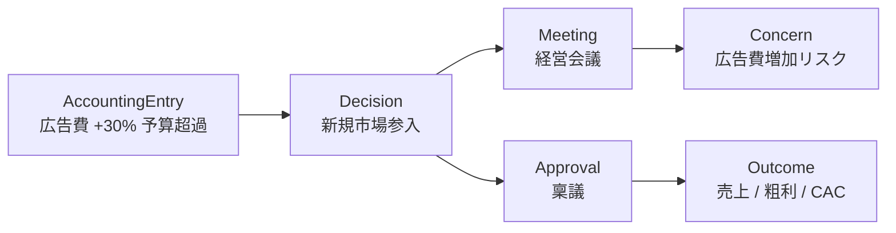
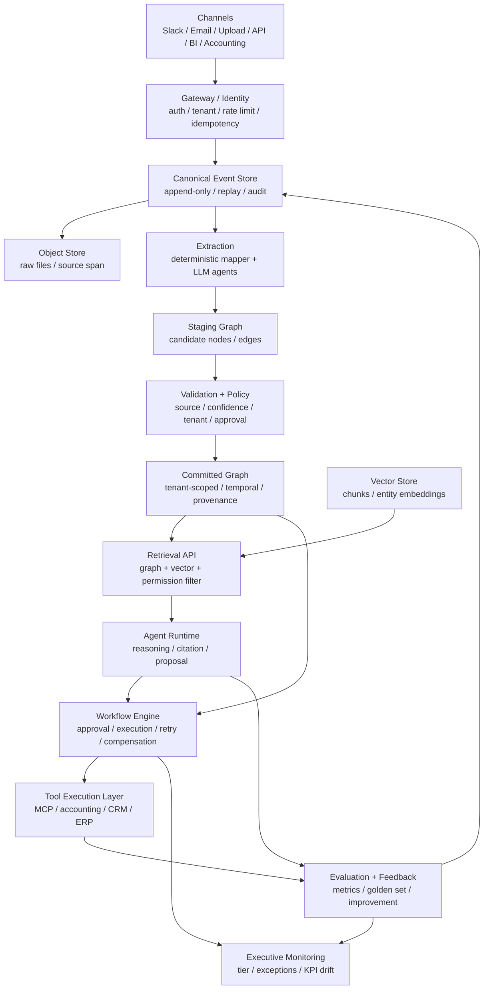

# KairosAI 事業・技術資料ドラフト

作成日: 2026-05-29  
位置づけ: `Brainstorm-Draft-v2.2.md` を引き継ぎ、社内説明・初期メンバー共有・投資家向け資料の骨子に変換した検討メモ  
前提資料: `Knowledge Graph 中核設計 — Brainstorm Draft`、ローカル既存メモ、2026-05-29 時点の公開情報による一部 sanity check

## 1. 資料としての結論

KairosAI は、単なる社内検索、RAG、チャットボット、経理自動化ツールではなく、企業の経営オペレーションを段階的に自動化するための **Autonomy Graph Platform** として打ち出すのが最も強い。

中核メッセージは次の一文に集約できる。

> KairosAI は、企業内の会話・文書・業務イベント・会計データを Canonical Event として記録し、根拠付き Knowledge Graph と Policy/Workflow に変換することで、AI が候補を作り、ポリシーが安全に判断し、Workflow が実行し、人間は例外とモニタリングに集中できる経営自動化基盤である。

この資料では、ブレストの「Knowledge Graph 中核設計」を、以下のように資料向けの主張へ再構成する。

| ブレスト上の表現 | 資料上の打ち出し |
| --- | --- |
| Knowledge Graph 中核設計 | 企業の業務メモリと監査可能な判断基盤 |
| Hybrid: Graph + Workflow First | AI の曖昧さと業務実行の厳密さを分離する設計 |
| Domain Pack | 新しい業務領域を追加するための product expansion unit |
| Autonomy Tier L0-L3 | 顧客に説明しやすい自動化成熟度モデル |
| Executive Monitoring | 「人間はモニタリングのみ」に近づける経営 UI |
| Evaluation / Feedback Loop | 使うほど精度と業務理解が蓄積する moat |

## 2. 資料の主戦場

資料では、技術詳細から入らない方がよい。最初に置くべき問題は、企業 AI が「回答」から「実行」へ進めない理由である。

企業が AI を業務に入れても、次の壁で止まる。

- 根拠が追えない
- どの情報が最新か分からない
- AI の推測と事実が混ざる
- 権限、承認、監査が既存業務とつながらない
- 会計、法務、人事、調達のような厳密業務では AI に最終判断を任せられない
- 利用ログが次の改善や業務知識として蓄積されない

KairosAI の答えは、AI に最終責任を持たせることではない。

AI は候補と根拠を作る。Policy Engine が事前合意済みルールで判定する。Workflow Engine が監査可能に実行する。人間はポリシー設計、例外対応、モニタリングに集中する。

この構図が、`Brainstorm-Draft-v2.2.md` の重要な再フレームである。

## 3. プロダクト定義

KairosAI は、以下 5 つのループを統合する。

| ループ | 内容 | 主要コンポーネント |
| --- | --- | --- |
| Sense | 会話、文書、会計、BI、外部システムイベントを取り込む | Source Adapter, Ingestion, Canonical Event |
| Remember | 根拠、関係性、時間軸、信頼度を保存する | Event Store, Object Store, Staging Graph, Committed Graph |
| Decide | AI の候補をポリシーで判定する | Extraction Agent, Validation Layer, Policy Engine |
| Execute | 承認、実行、補償、監査を行う | Workflow Engine, Tool Execution Layer |
| Learn | outcome と feedback を評価・改善に戻す | Evaluation Bus, Feature Store, Model/Prompt/Retrieval Update |

この 5 つを一体で持つことで、KairosAI は「回答する AI」ではなく「企業の判断と実行を育てる基盤」になる。

## 4. 初期ユースケース

初期ユースケースは 2 本に絞る。

### UC1: 経理・月次決算オペレーション

対象は、仕訳分類、消込、請求書・領収書、異常検知、月次レポート、監査対応。

ここでは数値処理を AI に任せない。借方・貸方一致、残高、消込、会計ルール、外部 API write は決定論的に処理する。AI は例外分類、説明、証跡整理、レビュー補助に使う。

最初の価値は「月次決算を AI が全部やる」ではなく、月次決算で発生する例外、根拠探し、監査資料化、承認ルーティングを減らすこと。

### UC2: 経営意思決定支援

対象は、KPI/予実、経営会議議事録、稟議、戦略文書、過去判断、論点整理、シナリオ分析。

ここでは、文書・会話・BI から意思決定、論点、懸念、根拠、反対意見、未解決タスクを抽出し、Graph と Vector を組み合わせて根拠付きに回答する。

最初の価値は「経営判断を AI が下す」ではなく、過去の判断経緯、根拠、未解決論点、現在の KPI とのつながりをすぐに辿れること。

## 5. なぜ 2 UC を同じ基盤に乗せるのか

経理と意思決定支援は一見別物だが、経営現場ではつながっている。

予算超過だけを見ると経理の異常だが、その背景には過去の意思決定、承認、リスク認識、期待された outcome がある。KairosAI の価値は、この横断関係を同じ Graph 上で扱う点にある。

## 6. アーキテクチャ要約

初期構成は、運用を重くしすぎないために次で始める。

| 領域 | Phase 1 推奨 |
| --- | --- |
| Event / Relational / Vector | PostgreSQL + pgvector |
| Staging Graph | PostgreSQL 別 schema、JSONB 中心 |
| Committed Graph | Neo4j Community、tenant_id property 強制 |
| Object Store | S3 compatible bucket |
| Workflow | Temporal を第一候補、MVP では軽量 workflow から開始可 |
| Agent Orchestration | LangGraph を第一候補、単純フローでは独自薄ラッパーも許容 |
| Inference | LiteLLM Gateway の下に managed/self-host を隠蔽 |

## 7. 設計原則

1. AI は候補と根拠を作る。事実確定と状態変更は Policy / Workflow が行う。
2. すべての node / edge に `tenant_id`, `source_event_id`, `source_span`, `confidence`, `label` を持たせる。
3. `EXTRACTED`, `INFERRED`, `AMBIGUOUS` を分ける。推論を事実として保存しない。
4. AI は Committed Graph に直接書かない。必ず Staging Graph と昇格ポリシーを通す。
5. 外部 API write、会計更新、送金、契約、承認は Workflow Engine 経由に限定する。
6. 評価と改善ループは最初から設計に入れる。あと付けにしない。
7. クロステナント学習は aggregate signal に限定し、raw event/document/golden data は共有しない。

## 8. Domain Pack 戦略

KairosAI の拡張単位は Domain Pack と定義する。

Domain Pack は、新しい業務領域を KairosAI に載せるための 7 要素セットである。

| 要素 | 内容 |
| --- | --- |
| Graph schema delta | ドメイン固有の node / edge |
| Workflow template | 決定論的な業務プロセス |
| Tool registry entry | 外部システム / MCP tool |
| Evaluation metric set | ドメイン固有の評価指標 |
| Extraction prompt set | 抽出 agent の prompt と few-shot |
| Approval routing rule | 承認、レビュー、escalation 条件 |
| Autonomy Tier policy | L0-L3 の現在値、目標、自動昇格条件 |

最初の Domain Pack は `accounting` と `decision`。次の拡張候補は `procurement`, `risk_compliance`, `sales`, `ops_general` がよい。理由は、L2-L3 へ進めやすく、業務成果を定量化しやすいから。

`legal`, `hr`, `strategy` は重要だが、法的責任・労務・経営判断の問題が強く、初期の完全自動化の主戦場にはしない。

## 9. Autonomy Tier

顧客への説明では、Autonomy Tier を前面に出すと分かりやすい。

| Tier | 説明 | 人間の関与 |
| --- | --- | --- |
| L0: Advisory | Agent は提案のみ | 全判断 |
| L1: Approved Autonomy | Agent が実行案を作り、人間が承認 | 案件単位承認 |
| L2: Bounded Autonomy | ポリシー範囲内で自動実行 | 例外対応と監査 |
| L3: Continuous Autonomy | 常時自動実行、人間は dashboard 監視 | モニタリング中心 |

Tier 引き上げ条件は、資料上では以下の 4 条件に整理する。

- ポリシー網羅率 95% 以上
- 例外率 5% 未満が 3 ヶ月継続
- 重大な audit / policy violation がゼロ
- 経営側 review と法務・監査確認を通過

「経営自動化、人間はモニタリングのみ」は、全領域を L3 にすることではない。経理、調達、オペレーション、リスク監視などルール化可能な業務を L3 に近づけ、戦略・法務・人事・経営判断は L1-L2 に留めるのが現実的である。

## 10. Executive Monitoring

経営層向け UI は、通常のシステム監視とは分けて設計する。

| コンポーネント | 役割 |
| --- | --- |
| Autonomy Dashboard | Domain Pack ごとの Tier、自動実行率、例外率、信頼度分布 |
| Exception Queue | ポリシーで判定できない案件の処理 |
| Policy Violation Alert | 想定外 allow / deny、tenant 越境、権限違反の通知 |
| KPI Drift Detector | 売上、粗利、在庫、人員、投資効率などの偏移検知 |
| Policy Update Proposer | 失敗・例外からポリシー改善案を提案 |
| Tier Lifecycle Tracker | Tier 昇格 / 降格条件の達成状況 |

この UI が、「人間はモニタリングのみ」に近づけるためのプロダクト上の入口になる。

## 11. MVP 提案

MVP は「汎用経営自動化基盤」を最初から作ろうとしない。最小構成は、2 つの Domain Pack と 1 つの横断デモに絞る。

### MVP ゴール

経理イベント、会議議事録、稟議、KPI メモを取り込み、以下ができること。

1. すべての入力が Canonical Event として保存される
2. 文書・会計イベントから node / edge 候補が Staging Graph に入る
3. source span / confidence / label に基づいて昇格・レビュー・却下される
4. Committed Graph から根拠付きに回答できる
5. 予算超過などの会計イベントから、関連する意思決定・議事録・稟議まで辿れる
6. 修正・採用・却下が feedback として記録される

### MVP に入れるもの

| 項目 | 内容 |
| --- | --- |
| Ingestion | Markdown / PDF / CSV / Slack export の手動 upload |
| Canonical Event | `event_id`, `tenant_id`, `source_system`, `source_span`, `payload`, `pii_flags` |
| Staging Graph | node / edge 候補、confidence、review status |
| Committed Graph | `Person`, `Company`, `Meeting`, `Decision`, `Concern`, `Action`, `AccountingEntry`, `Approval`, `Outcome` |
| Retrieval API | tenant-aware graph query + vector search |
| Agent UI | 根拠付き Q&A、参照 node、source span 表示 |
| Review Console | node / edge の approve / reject / edit |
| Eval smoke set | 50 件程度の citation / extraction / accounting validation |

### MVP から外すもの

| 外すもの | 理由 |
| --- | --- |
| 外部会計システムへの write | 監査・承認・補償の設計が必要 |
| Self-host GPU 本番運用 | 初期は managed / local small model / provider abstraction で十分 |
| Full fine-tune / RLHF | データ量、評価基盤、運用体制が未成熟 |
| 全 Domain Pack | まず accounting + decision に集中 |
| L3 自動実行 | 先に L0-L1 で根拠、評価、レビューを固める |

## 12. Phase Roadmap

| Phase | 期間目安 | ゴール | 主な成果物 |
| --- | --- | --- | --- |
| Phase 0 | 1-2 週 | 仕様固定 | Canonical Event spec、Graph schema v0、昇格ポリシー、MVP dataset |
| Phase 1 | 4-6 週 | Read-only MVP | Ingestion、Staging Graph、Committed Graph、根拠付き Q&A、Review Console |
| Phase 2 | 6-8 週 | Workflow MVP | 承認ルーティング、Policy Decision Log、軽量 workflow、Evaluation Bus |
| Phase 3 | 8-12 週 | Pilot | accounting / decision の限定顧客 pilot、Executive Dashboard v0 |
| Phase 4 | 3-6 ヶ月 | Expansion | procurement / risk / ops Domain Pack、managed/self-host routing、golden dataset 拡張 |

## 13. 直近で仕様化すべきもの

既存 Linear の `MTZ-199`, `MTZ-200`, `MTZ-197`, `MTZ-198` に加え、資料化の観点では以下を切るとよい。

| 優先 | Spec | 目的 |
| --- | --- | --- |
| P0 | Canonical Event schema | 入口の共通形式。再処理、監査、source span の土台 |
| P0 | Staging to Committed policy | AI 候補をいつ事実扱いするか |
| P0 | Graph schema v0 | accounting + decision の node / edge / metadata |
| P0 | MVP dataset definition | デモと評価に使うサンプルデータ |
| P1 | Retrieval API | graph + vector + permission filtering の interface |
| P1 | Policy Decision Log | 監査可能な allow / deny / escalate の記録 |
| P1 | Evaluation Bus | citation / extraction / accounting validation の評価 |
| P1 | Domain Pack convention | 将来の拡張単位を規約化 |
| P2 | Executive Monitoring v0 | Autonomy Dashboard と Exception Queue |
| P2 | AI governance / legal responsibility | ポリシー設計者、Tier 昇格、法務・監査 review の責任境界 |

## 14. 技術判断の扱い

ブレストの Section 6 は技術的に重要だが、資料の本編では深掘りしすぎない方がよい。モデル名、GPU 単価、provider 価格は変動が激しく、意思決定者向け資料では「交換可能な推論基盤」として扱う。

資料本編で言うべきこと:

- Inference は LiteLLM などの gateway で抽象化し、self-host と managed を切り替える
- Phase 1 は fine-tune せず、prompt + graph context + evaluation で始める
- 自社 fine-tune / LoRA / self-host GPU は Phase 2 以降
- 経営機密を扱う tenant は data residency と model provider の保持ポリシーを個別確認する

Appendix に回すべきこと:

- GPU provider ごとの単価
- H100 / H200 / B200 の調達戦略
- 具体的な OSS model SKU
- LoRA framework 比較
- Managed inference provider 比較

2026-05-29 時点の sanity check では、ブレスト内のモデル・価格情報は「方向性」は使えるが、資料に載せる場合は SKU 名と価格を再確認する必要がある。特に `Qwen 3.6 Plus` のような表記は、公開モデル名として確認できる表記に正規化してから使う。

## 15. 主要リスクと対策

| リスク | 内容 | 対策 |
| --- | --- | --- |
| 責任境界 | AI が判断したように見えると法務・監査上危険 | AI は候補、Policy が判定、Workflow が実行という責務を UI とログで明示 |
| Graph 複雑化 | node / edge が増えすぎて品質が落ちる | MVP schema を小さくし、Domain Pack ごとに schema delta を管理 |
| 監査不足 | 自動化が進むほど説明責任が重い | Policy Decision Log、Workflow execution log、source span を必須化 |
| データ混入 | tenant 間で情報が混ざる | tenant_id 強制、RLS、query layer、log 分離、上位 tier は物理分離 |
| ROI 不明確 | Graph の価値が抽象的に見える | 月次決算短縮、例外率、引用妥当性、調査時間削減で測る |
| モデル依存 | 特定モデルや provider にロックイン | Gateway、multi-model routing、評価 dashboard で交換可能にする |
| 法規制 | AI ガバナンス、個人情報、業界規制 | 別 Spec で責任境界と Tier 昇格承認フローを定義 |

## 16. 資料スライド構成案

1. Title: KairosAI - Autonomy Graph Platform
2. Problem: 企業 AI は回答で止まり、実行と監査につながらない
3. Insight: AI に最終判断させず、人間判断を事前ポリシーに変換する
4. Product: Sense / Remember / Decide / Execute / Learn の 5 ループ
5. Architecture: Event Log + Staging Graph + Policy + Workflow + Evaluation
6. Initial Use Cases: 経理・月次決算、経営意思決定支援
7. Cross-domain Value: 予算超過から意思決定経緯まで辿れる
8. Domain Pack: 新しい業務領域を追加する単位
9. Autonomy Tier: L0 から L3 への段階的自動化
10. MVP: Read-only graph + review + citation + evaluation
11. Roadmap: Phase 0-4
12. Moat: provenance graph、policy/workflow、evaluation loop、domain pack catalog
13. Risks: 責任境界、監査、tenant、model volatility
14. Ask / Next: spec 固定、MVP dataset、pilot candidate

## 17. 追加で作るとよい資料

次に作るなら、以下 3 本が実用的。

| 資料 | 用途 |
| --- | --- |
| Investor / recruiting deck | 14 枚程度。事業仮説、差別化、MVP、ロードマップを見せる |
| Architecture decision record | 技術者向け。なぜ Graph + Workflow + Policy なのかを決める |
| MVP implementation plan | 実装者向け。schema、API、画面、評価、タスク分解 |

現時点では、このファイルを deck 化の元原稿として使い、次に `MVP implementation plan` へ落とすのがよい。

## 18. 引き継ぎメモ

前回までの作業では `MTZ-196`、つまり Section 3 のシステム構成はほぼ完了している。今回の資料化で見えた次の焦点は、`MTZ-199` と `MTZ-200` を単なる技術 spec ではなく、プロダクトの信頼性を支える最重要 spec として扱うこと。

最短の次アクション:

1. `Canonical Event schema v0` を 1 ファイルにする
2. `Staging to Committed policy v0` を accounting / decision に分けて書く
3. `Graph schema v0` を node / edge / required metadata で定義する
4. MVP dataset を 20-50 件作る
5. この資料を 14 枚の deck に変換する

## Sources

内部 / private:

- GitHub: [Brainstorm-Draft-v2.2.md](https://github.com/mtzd3/claude-workspace/blob/main/Projects/KairosAI/Brainstorm-Draft-v2.2.md)
- Local: `/Users/so01/codex/Kairos/kairosai-explainer-2026-05-27.md`
- Local: `/Users/so01/codex/Kairos/kairosai-linear-progress-2026-05-27.md`
- Local: `/Users/so01/codex/Agentic AI PJ/core-product-business-model.md`
- Local: `/Users/so01/codex/Agentic AI PJ/agentic-knowledge-graph-idea.md`
- Local: `/Users/so01/codex/Agentic AI PJ/technical-architecture-elements.md`
- Local: `/Users/so01/codex/Agentic AI PJ/financial-institution-tokenized-operations.md`

Public sanity check references:

- [Qwen3-30B-A3B on Hugging Face](https://huggingface.co/Qwen/Qwen3-30B-A3B)
- [Qwen3-235B-A22B on Hugging Face](https://huggingface.co/Qwen/Qwen3-235B-A22B)
- [vLLM documentation](https://docs.vllm.ai/)
- [SGLang documentation](https://docs.sglang.io/)
- [SGLang LoRA Serving](https://docs.sglang.io/advanced_features/lora.html)
- [LiteLLM documentation](https://docs.litellm.ai/)
- [Temporal documentation](https://docs.temporal.io/)
- [Neo4j Operations Manual](https://neo4j.com/docs/operations-manual/)
- [European Commission: AI Act](https://digital-strategy.ec.europa.eu/en/policies/regulatory-framework-ai)
